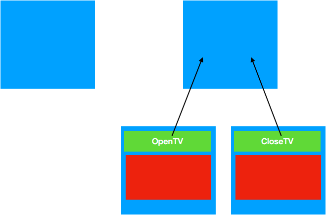
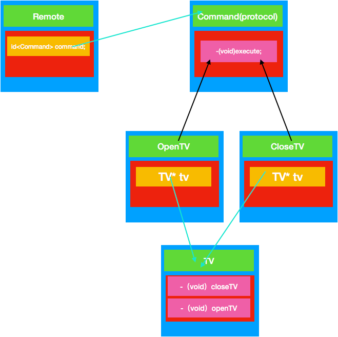
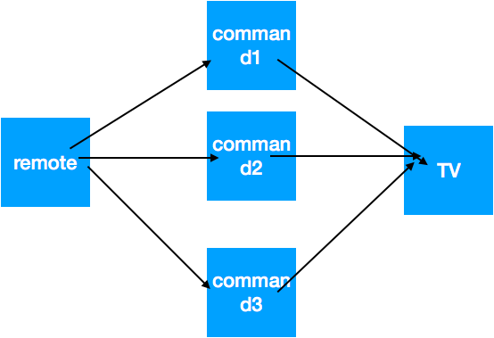
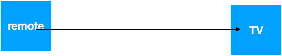

#  命令模式

命令模式可以将"动作的请求者" 从 "动作的执行者"对象中解耦.

### 定义
将"请求" 封装成对象,以便使用不同的请求,队列或者日志来参数化其他对象.命令模式也支持可撤销的操作


空命令 可以降低if else

空对象本身也被视作一种设计模式

举例 线程池

# 定义
将一个请求封装成一个对象，从而使您可以用不同的请求对客户进行参数化。

***
# 角色

1、received 真正的命令执行对象
2、Command 
3、invoker 使用命令对象的入口

***
# 优缺点
###优点
1、降低了系统耦合度。 
2、新的命令可以很容易添加到系统中去。

### 缺点
使用命令模式可能会导致某些系统有过多的具体命令类。
***
# 场景模拟
遥控器遥控电视


***
# 命令模式UML图


***
# 简单代码

```
#import <Foundation/Foundation.h>

@protocol Command <NSObject>
-(void)execute;
@end

```
```
#import <Foundation/Foundation.h>
#import "Command.h"
@interface OpenTV : NSObject<Command>
@end
```
```
#import "OpenTV.h"
@implementation OpenTV
-(void)execute{
    NSLog(@"打开电视");
}
@end
```

```
#import <Foundation/Foundation.h>
#import "Command.h"

@interface CloseTV : NSObject<Command>

@end
```
```
#import "CloseTV.h"
@implementation CloseTV
-(void)execute{
    NSLog(@"关闭电视");
}
@end

```
```
#import <Foundation/Foundation.h>
#import "Command.h"
@interface Remote : NSObject

-(void)setCommand:(id<Command>)command;
-(void)invokeCommand;
@end
```
```

#import "Remote.h"
@interface Remote()
@property (nonatomic,strong) id<Command> command;
@end
@implementation Remote

-(void)setCommand:(id<Command>)command
{
    _command = command;
}

-(void)invokeCommand{
    [self.command execute];
}
@end

```

测试代码
```
  Remote * remote = [Remote new];
    OpenTV *openTV = [OpenTV new];
    CloseTV * closeTV = [CloseTV new];
    [remote setCommand:openTV];
    [remote invokeCommand];
    [remote setCommand:closeTV];
    [remote invokeCommand];
```
测试结果
```
2018-04-10 13:53:40.898689+0800 行为型设计模式-命令模式[53130:8160569] 打开电视
2018-04-10 13:53:40.898824+0800 行为型设计模式-命令模式[53130:8160569] 关闭电视
```

> 看别人写的命令模式样板都是在command 中引入一个可以执行命令的对象 。我这里只是单纯的打印下，要是修改成别人的样子应该，在OpenTV 和CloseTV 中引入一个TV 类，这个TV 类应该包含closeTV 和openTV等实现。每次执行execute方法的时候，交给这个TV 对象去执行。

# UML 图如下



> 其实TV类可以设计成接口，就可以随便更换电视机了。

***






这两个图对比，我们知道，命令模式相当于中间加了一层。假如我们有一个新命令，撤销功能，那么我们只需要新增一个command类，TV 实现不实现撤销功能，reomote调用都不会导致程序出问题，非命令模式就不行了，要是不实现命令模式那么调用肯定要报错。

这符合设计模式的六大原则之开闭原则。

***


[借鉴博客]（http://www.runoob.com/design-pattern/command-pattern.html）


