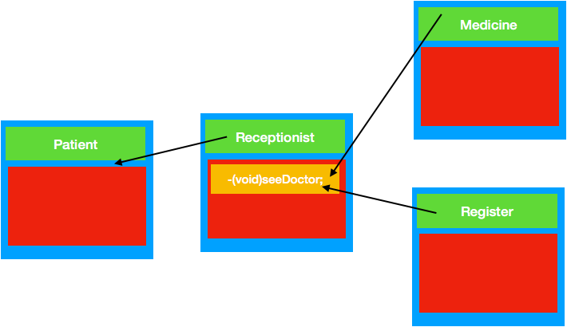

#  外观模式

# 定义
外观模式（[Facade](https://baike.baidu.com/item/Facade/2954918)），为子系统中的一组接口提供一个一致的界面，定义一个高层接口，这个接口使得这一子系统更加容易使用。

***

# 适用场景
在以下情况下可以考虑使用外观模式：
>  为复杂的模块或子系统提供外界访问的模块；
>  子系统相互独立；
>  在层析结构中，可以使用外观模式定义系统的每一层的入口。

***
# 优点
 >** 松散耦合**
>使得客户端和子系统之间解耦，让子系统内部的模块功能更容易扩展和维护；
> **简单易用**
>客户端根本不需要知道子系统内部的实现，或者根本不需要知道子系统内部的构成，它只需要跟Facade类交互即可。
> **更好的划分访问层次**
>有些方法是对系统外的，有些方法是系统内部相互交互的使用的。子系统把那些暴露给外部的功能集中到门面中，这样就可以实现客户端的使用，很好的隐藏了子系统内部的细节。


# 角色
+ **门面角色**：外观模式的核心。它被客户角色调用，它熟悉子系统的功能。内部根据客户角色的需求预定了几种功能的组合。

+ **子系统角色**:实现了子系统的功能。它对客户角色和Facade时未知的。它内部可以有系统内的相互交互，也可以由供外界调用的接口。

+ **客户角色**:通过调用Facede来完成要实现的功能。

***
#场景模拟
 去医院看病，可能要去挂号、门诊、划价、取药，让患者或患者家属觉得很复杂，如果有提供接待人员，只让接待人员来处理，就很方便。

***
# 外观模式UML图



***

# 简单代码

```
#import <Foundation/Foundation.h>

@interface Receptionist : NSObject
-(void)seeDoctor;
@end
```
```

#import "Receptionist.h"
#import "Register.h"
#import "Medicine.h"
@implementation Receptionist
-(void)seeDoctor{
    [[Register new]reginster];
    [[Medicine new]medicine];
}

@end
```
```
#import <Foundation/Foundation.h>

@interface Medicine : NSObject
-(void)medicine;
@end
```
```
#import "Medicine.h"

@implementation Medicine
-(void)medicine{
    NSLog(@"病人取药");
}
@end
```
```
#import "Register.h"

@implementation Register
-(void)reginster{
    NSLog(@"病人注册");
}
@end

```
```
#import <Foundation/Foundation.h>

@interface Register : NSObject
-(void)reginster;

@end
```

```
#import <Foundation/Foundation.h>
#import "Receptionist.h"
@interface Patient : NSObject
@property (nonatomic,strong) Receptionist *receptionist;
@end

```

```
#import "Patient.h"

@implementation Patient

@end

```
测试代码
```
   Receptionist * receptionist= [Receptionist new];
   Patient * patients= [[Patient alloc]init];
    patients.receptionist =receptionist;
    [patients.receptionist seeDoctor];
```

测试结果
```
2018-04-09 12:46:37.516153+0800 结构型设计模式-外观模式[37443:7517248] 病人注册
2018-04-09 12:46:37.516303+0800 结构型设计模式-外观模式[37443:7517248] 病人取药
```
> 上面的receptionist 可以现实一个协议，实现一个子类实现该协议扩展更好
***

其实外观模式相对来说比较简单，在ios中，我们经常引用第三方框架，我们其实这里就可以做成外观模式，要是以后替换第三方框架省心不少。（很简单，网络请求框架asi 换成 AFNetworking，要是以前没有这个中间代理人，那么要全工程都要改一遍，要是有这个中间者，只在这个中间者中修改就可以了）
