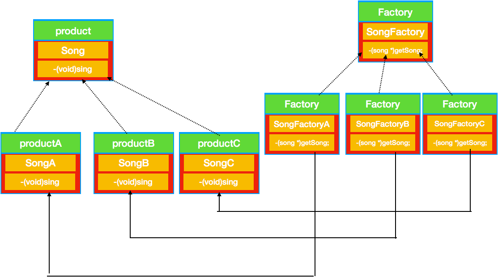

#  工厂模式

初始化对象经常会造成`耦合`问题


### 简单工厂模式

利用静态方法定义一个简单的工厂,这是常用技巧,这种也被成为静态工厂.
优点是这种方法不用创建对象就能实例化对象. 
缺点是补鞥呢通过继承来改变状态方法的行为.

简单工厂不是设计模式,可以理解为编程习惯.(用的比较多而已)

### 工厂模式
工厂模式是用来封装对象的创建. 工厂方法模式通过让`子类`决定该创建的对象是什么,来达到将对象创建过程封装的目的


> 工厂方法模式定义了创建对象的接口,但由子类决定要实例化的类是哪一个.工厂方法把实例化推迟到了子类.

简单工厂和工厂的差别
> 简单工厂是委托给工厂 生产对象
> 工厂是子类生产对象

工厂模式是个很好的依赖倒转原则的举例

### 抽象工厂

抽象工厂为产品家族提供接口.

抽象工厂中派生出一些具体的工厂,这些工厂生产相同的产品,但是产品的实现不同

> 抽象工厂模式提供了一个接口,用于创建相关或依赖对象的家族,而不需要明确指定具体类.


抽象工厂和工厂方法的区别
抽象工厂使用的是组合
工厂方法使用的是继承


# 概念

工厂模式是我们最常用的实例化对象模式了，是用工厂方法代替new操作的一种模式。

* * *

# 分类

工厂模式分类，简单工厂模式，工厂方法模式，抽象工厂模式

* * *

# 简单工厂模式

## 介绍

简单工厂模式是属于创建型模式，又叫做静态工厂方法（Static Factory Method）模式，但不属于23种GOF设计模式之一。简单工厂模式是由一个工厂对象决定创建出哪一种产品类的实例。简单工厂模式是工厂模式家族中最简单实用的模式，可以理解为是不同工厂模式的一个特殊实现。

## **延伸**

试想一下，当我们在codeing的时候，在A类里面只要NEW了一个B类的对象，那么A类就会从某种程度上依赖B类。如果在后期需求发生变化或者是维护的时候，需要修改B类的时候，我们就需要打开源代码修改所有与这个类有关的类了，做过重构的朋友都知道，这样的事情虽然无法完全避免，但确实是一件让人心碎的事情

## 场景

我发现大家写这类博客都喜欢弄个场景，那我也弄个吧。假设你非常喜欢唱歌，是个歌手，每天晚上你都会回家唱一首歌曲，今天你唱《天天喜欢你》，明天喜欢唱《十年》，后天唱《明天就要嫁给你》，你每天唱那一首歌都是随机的。

## UML 图


## 简单代码

```objective-c
#import <Foundation/Foundation.h>
@protocol Song -(void)sing;
@end
```

```objc
#import "Song.h"
@interface SongA : 
NSObject
@end
```

```objc
#import "SongA.h"
@implementation SongA
-(void)sing{
    NSLog(@"sing 《天天喜欢你》");
}
@end
```

```objc
#import "Song.h"
@interface SongB : NSObject
@end
```

```objc
#import "SongB.h"
@implementation SongB
-(void)sing{
    NSLog(@"sing 《十年》");
}
@end
```

```objc
#import "Song.h"
@interface SongC : NSObject
@end
```

```objc
@implementation SongC
-(void)sing{
    NSLog(@"sing 《明天就要嫁给你》");
}
@end
```

```objc
#import "SongA.h"
#import "SongB.h"
#import "SongC.h"
#import "Song.h"
typedef enum {
  SongAType,
  SongBType,
  SongCType
}SongType;
@interface SongFactory : NSObject
-(id)getSongType:(SongType)songType;
@end
```

```OBJC
#import "SongFactory.h"
@implementation SongFactory
-(id)getSongType:(SongType)songType{
    if (songType==SongAType) {
        return [SongA  new];
    }else if (songType==SongBType){
        return [SongB new];
    }else if (songType == SongCType){
        return [SongC new];
    }else{
        return nil;
    }
    return nil;
}
@end
```

```objc
		SongFactory * factory=[[SongFactory alloc]init];
		id song = [factory getSongType:SongAType];
   	[song sing];
    song = [factory getSongType:SongBType];
    [song sing];
    song = [factory getSongType:SongCType];
    [song sing];
```


测试结果很简单

> 2018-04-02 17:31:55.153472+0800 创建型模式-工厂模式[31997:5155859] sing 《天天喜欢你》
>
> 2018-04-02 17:31:55.153638+0800 创建型模式-工厂模式[31997:5155859] sing 《十年》
>
> 2018-04-02 17:31:55.153745+0800 创建型模式-工厂模式[31997:5155859] sing 《明天就要嫁给你》

## 优点

> 简单工厂模式能够根据外界给定的信息，决定究竟应该创建哪个具体类的对象。明确区分了各自的职责和权力，有利于整个软件体系结构的优化。

## 缺点

> 很明显工厂类集中了所有实例的创建逻辑，容易违反GRASPR的高内聚的责任分配原则

* * *

# 工厂方法模式

## 介绍

工厂方法模式Factory Method，又称多态性工厂模式。在工厂方法模式中，核心的工厂类不再负责所有的产品的创建，而是将具体创建的工作交给子类去做。该核心类成为一个抽象工厂角色，仅负责给出具体工厂子类必须实现的接口，而不接触哪一个产品类应当被实例化这种细节。

## 定义

**工厂方法模式是简单工厂模式的衍生**，解决了许多简单工厂模式的问题。首先完全实现‘开－闭 原则’，实现了可扩展。其次更复杂的层次结构，可以应用于产品结果复杂的场合。

## **延伸**

在上面简单工厂的引入中，我们将实例化具体对象的工作全部交给了专门负责创建对象的工厂类(场务)中，这样就可以在你需要唱歌的时候后创建对应的歌曲(产品)类了。但是有时候唱歌有心情的，比如要唱一首新歌《青花瓷》，就必须要修改源码，增加一个if else。工厂方法就是解决这个问题而产生的。

## 模拟场景

假设你今天想场《青花瓷》，明天想唱《霸王别姬》，每天想增加一手新歌，因此工厂模式的扩展性增强很多

## UML图



其实我们看这个图和简单工厂的UML图比较，就是将Factory 中根据type类型获取歌曲变成了每一个工厂生产特定的歌曲。这样每次增加一首歌曲，那么我们就增加一个factory就行了，不用在修改Factory类了

## 简单代码

歌曲abc 的代码没有任何变化

```OBJC
#import "Song.h"
@protocol MySongFactory<NSObject>
-(id)getSong;
@end
```

```objc
#import "MySongFactory.h"
@interface SongFactoryA : NSObject<MySongFactory>

@end
```

```objective-c
#import "SongA.h"
@implementation SongFactoryA
-(id)getSong{
    return [SongA new];
}
@end
```

```objc
#import "MySongFactory.h"
@interface SongFactoryB : NSObject<MySongFactory>

@end
```

```objc
#import "SongFactoryB.h"
#import "SongB.h"
@implementation SongFactoryB
-(id<Song>)getSong{
    return [SongB new];
}
@end
```

```objc
#import "MySongFactory.h"
@interface SongFactoryC : NSObject<MySongFactory>

@end
```

```objc
#import "SongFactoryC.h"
#import "SongC.h"
@implementation SongFactoryC
-(id<Song>)getSong{
    return [SongC new];
}
@end
```

测试代码

```objc
id<MySongFactory> factory=[SongFactoryA new];
id<Song> song = [factory getSong];
    [song sing];
    factory=[SongFactoryB new];
    song = [factory getSong];
    [song sing];
    factory=[SongFactoryC new];
    song = [factory getSong];
    [song sing];
```

测试结果

> 2018-04-02 18:21:39.573105+0800 创建型模式-工厂模式[44856:5211772] sing 《天天喜欢你》
>
> 2018-04-02 18:21:39.573325+0800 创建型模式-工厂模式[44856:5211772] sing 《十年》
>
> 2018-04-02 18:21:39.573447+0800 创建型模式-工厂模式[44856:5211772] sing 《明天就要嫁给你》

## 优点

**子类提供挂钩。基类为工厂方法提供缺省实现，子类可以重写新的实现，也可以继承父类的实现。-- 加一层间接性，增加了灵活性**

**屏蔽产品类。产品类的实现如何变化，调用者都不需要关心，只需关心产品的接口，只要接口保持不变，系统中的上层模块就不会发生变化。**

典型的解耦框架。高层模块只需要知道产品的抽象类，其他的实现类都不需要关心，符合迪米特法则，符合依赖倒置原则，符合里氏替换原则。

多态性：客户代码可以做到与特定应用无关，适用于任何实体类。

## 缺点

需要Creator和相应的子类作为factory method的载体，如果应用模型确实需要creator和子类存在，则很好；否则的话，需要增加一个类层次。(不过说这个缺点好像有点吹毛求疵了)

[借鉴博客](https://www.cnblogs.com/toutou/p/4899388.html)


# 抽象工厂模式

## **介绍**

抽象工厂模式是所有形态的工厂模式中最为抽象和最具一般性的一种形态。抽象工厂模式是指当有多个抽象角色时，使用的一种工厂模式。抽象工厂模式可以向客户端提供一个接口，使客户端在不必指定产品的具体的情况下，创建多个产品族中的产品对象。根据里氏替换原则，任何接受父类型的地方，都应当能够接受子类型。因此，实际上系统所需要的，仅仅是类型与这些抽象产品角色相同的一些实例，而不是这些抽象产品的实例。换言之，也就是这些抽象产品的具体子类的实例。工厂类负责创建抽象产品的具体子类的实例。

## 定义

为创建一组相关或相互依赖的对象提供一个接口，而且无需指定他们的具体类。

## 模拟场景

我们还是继续假设这个人喜欢唱歌，唱歌需要麦克风，音响等等设备。但是具体用哪个牌子的麦克风或者音响，要看个人喜爱和当天的心情。

        我们把这个场景进行划分：

        抽象工厂：个人当天需要的设备

        具体工厂：当天用的到底是哪个品牌的麦克风和音响

       抽象产品：肯定就是麦克风或者音响了

        具体产品：就是具体的牌子的麦克风或者音响

## 抽象工厂的UML 图


## 代码片段

产品audio

```objc
@protocol audio <NSObject>
  -(void)audio;
@end
```

```objc
#import "audio.h"
@interface AudioA : NSObject<audio>
@end
```

```OBJC
#import "AudioA.h"
@implementation AudioA
-(void)audio{
    NSLog(@"audioA audio");
}
@end
```

```OBJC
#import "audio.h"
@interface AudioB : NSObject<audio>
@end
```

```objc
#import "AudioB.h"
@implementation AudioB
-(void)audio{
    NSLog(@"audioB audio");
}
@end
```

产品Microphone

```OBJC
@protocol Microphone<NSObject>
-(void)song;
@end
```

```objc
#import "Microphone.h"
@interface MicrophoneA : NSObject<Microphone>

@end
```

```OBJC
#import "MicrophoneA.h"
@implementation MicrophoneA
-(void)song{
    NSLog(@"microphoneA song");
}
@end
```

```OBJC
#import "Microphone.h"
@interface MicrophoneB : NSObject<Microphone>

@end
```

```OBJC
#import "MicrophoneB.h"
@implementation MicrophoneB
-(void)song{
    NSLog(@"microphoneB song");
}
@end
  
```

工厂个人需求persionNeeds

```OBJC
#import "Microphone.h"
#import "audio.h"
@protocol PersionNeeds<NSObject>
-(id<Microphone>)getMicrophone;
-(id<audio>)getAudio;
@end
```

```OBJC
#import "PersionNeeds.h"
@interface PersionNeedsA : NSObject<PersionNeeds>

@end
```

```objc
@implementation PersionNeedsA
-(id<audio>)getAudio{   
return [AudioA new];
}
-(id<Microphone>)getMicrophone{
    return [MicrophoneA new];
}
@end
```

```objc
#import "PersionNeeds.h"
@interface PersionNeedsB : NSObject<PersionNeeds>

@end
```

```objc
#import "PersionNeedsB.h"
#import "AudioB.h"
#import "MicrophoneB.h"
@implementation PersionNeedsB
-(id<audio>)getAudio{ 
  return [AudioB new];
}
-(id<Microphone>)getMicrophone{
    return [MicrophoneB new];
}
@end
```

测试类

```objc
		id<PersionNeeds> persionNeeds = [PersionNeedsA new];
		id<audio> audio = [persionNeeds getAudio]; 
  	id<Micriphone> microphone = [persionNeeds getMicrophone];
    [audio audio];
    [microphone song];
    persionNeeds = [PersionNeedsB new];
    audio = [persionNeeds getAudio];
    microphone = [persionNeeds getMicrophone];
    [audio audio];
    [microphone song];
```


测试结果是

> 2018-04-03 10:03:55.841091+0800 创建型模式-工厂模式[75521:5357736] audioA audio
>
> 2018-04-03 10:03:55.841222+0800 创建型模式-工厂模式[75521:5357736] microphoneA song
>
> 2018-04-03 10:03:55.841345+0800 创建型模式-工厂模式[75521:5357736] audioB audio
>
> 2018-04-03 10:03:55.841427+0800 创建型模式-工厂模式[75521:5357736] microphoneB song

## 优点

抽象工厂模式隔离了具体类的生产，使得客户并不需要知道什么被创建。

当一个产品族中的多个对象被设计成一起工作时，它能保证客户端始终只使用同一个产品族中的对象。

增加新的具体工厂和产品族很方便，无须修改已有系统，符合“开闭原则”。

## 缺点

增加新的产品等级结构很复杂，需要修改抽象工厂和所有的具体工厂类，对“开闭原则”的支持呈现倾斜性。

* * *

我们分析下这三种工厂模式

工厂模式其实就是简单工厂模式的升级版本而已，这样就不用简单工厂里面的if else 判断了。而是将if else 中的逻辑用特定类来代替

抽象工厂和工厂模式比较，看UML 图，要是把抽象工厂生产的产品限定是一个的话，那么抽象工厂的图和工厂模式的UML完全相同。可以理解为工厂模式是抽象工厂模式的一种特例。

抽象工厂的产品比简单工厂模式多，所以，就产生了自由组合，demo中，PersionNeedsA 生成的是具体产品是AudioA 和MicrophoneA ,persionNeedB 生成的AudioB 和MicriphoneB。我们也可以组装一个工厂PersionNeedsC生产AudioA和MicriophoneB。

[借鉴博客](https://www.cnblogs.com/toutou/p/4899388.html)

