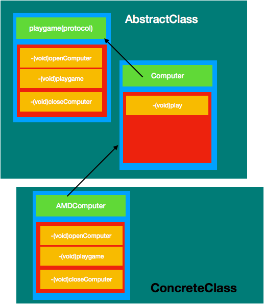

#  模板方法模式

# 定义
定义一个操作中的算法的骨架，而将一些步骤延迟到子类中。模板方法使得子类可以不改变一个算法的结构即可重定义该算法的某些特定步骤。

***
# 角色
AbstractClass: 抽象类  
ConcreteClass:  具体子类 

****
# 优缺点
### 优点
 1、封装不变部分，扩展可变部分。
 2、提取公共代码，便于维护。
 3、行为由父类控制，子类实现。
### 缺点
每一个不同的实现都需要一个子类来实现，导致类的个数增加，使得系统更加庞大。（这难道也算是缺点么，哈哈哈）

*****
# 使用场景
 1、有多个子类共有的方法，且逻辑相同。
 2、重要的、复杂的方法，可以考虑作为模板方法。

****
 # 场景模拟
打开好多电脑玩游戏
# UML图


# 简单代码

```
@protocol PlayGame <NSObject>
-(void)openComputer;
-(void)playGame;
-(void)closeComputer;
@end
```
```

#import <Foundation/Foundation.h>
#import "PlayGame.h"
@interface Computer : NSObject<PlayGame>
-(void)play;
@end

```
```
#import "Computer.h"

@implementation Computer
-(void)play{
    [self openComputer];
    [self playGame];
    [self closeComputer];
}
@end
```

```
#import <Foundation/Foundation.h>
#import "Computer.h"
@interface AMDComputer : Computer

@end

```
```

#import "AMDComputer.h"

@implementation AMDComputer
-(void)openComputer{
    NSLog(@"AMD 打开电脑");
}
-(void)playGame{
    NSLog(@"AMD 玩游戏");
}
-(void)closeComputer{
     NSLog(@"AMD 关闭电脑");
}
@end

```
测试代码
```
   Computer * computer = [AMDComputer new];
    [computer play];
```

测试结果

```
2018-04-11 16:03:55.016264+0800 行为型设计模式-模板方法模式[71826:8771965] AMD 打开电脑
2018-04-11 16:03:55.016451+0800 行为型设计模式-模板方法模式[71826:8771965] AMD 玩游戏
2018-04-11 16:03:55.016602+0800 行为型设计模式-模板方法模式[71826:8771965] AMD 关闭电脑
```


