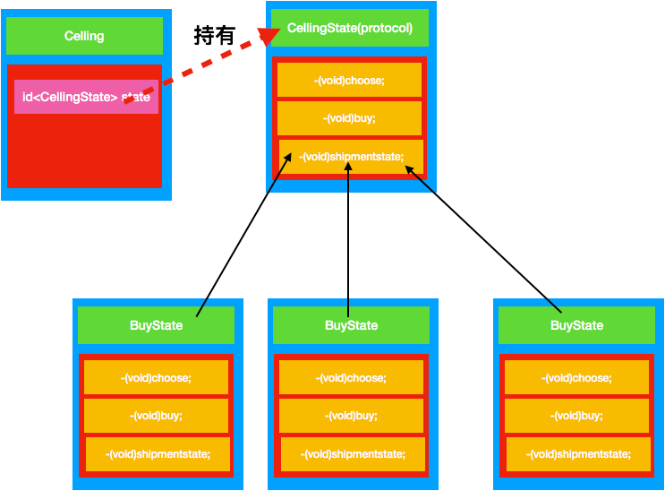

#  状态模式

# 定义
允许对象在内部状态发生改变时改变它的行为，对象看起来好像修改了它的类。
****

# 解决问题
对象的行为依赖于它的状态（属性），并且可以根据它的状态改变而改变它的相关行为。

# 角色
>（1）Context类，定义客户端所感兴趣的接口，并且内部维护一个具体状态类的实例，从而维护了对象的现有状态。
>（2）State：抽象状态类或状态接口，用以抽象封装行为。
>（3）ConcreteState类：具体状态类，实现了State中的抽象方法。

****
# 使用条件
代码中包含大量与对象状态有关的条件语句。

# 代码解析
状态模式的接口中有一个或者多个方法。而且，状态模式的实现类的方法，一般返回值，或者是改变实例变量的值。也就是说，状态模式一般和对象的状态有关。实现类的方法有不同的功能，覆盖接口中的方法。状态模式和命令模式一样，也可以用于消除 if...else 等条件选择语句。
***
# 优缺点
### 优点
1、封装了转换规则。
2、枚举可能的状态，在枚举状态之前需要确定状态种类。 
3、将所有与某个状态有关的行为放到一个类中，并且可以方便地增加新的状态，只需要改变对象状态即可改变对象的行为。
4、允许状态转换逻辑与状态对象合成一体，而不是某一个巨大的条件语句块。 5、可以让多个环境对象共享一个状态对象，从而减少系统中对象的个数。

### 缺点
1、状态模式的使用必然会增加系统类和对象的个数。 
2、状态模式的结构与实现都较为复杂，如果使用不当将导致程序结构和代码的混乱。 
3、状态模式对"开闭原则"的支持并不太好，对于可以切换状态的状态模式，增加新的状态类需要修改那些负责状态转换的源代码，否则无法切换到新增状态，而且修改某个状态类的行为也需修改对应类的源代码。

****
# 使用场景
 1、行为随状态改变而改变的场景。
 2、条件、分支语句的代替者。
******
# 场景模拟
自动贩卖机买东西 ，选择物品，投币，出货
******
# 状态模式的UML 图




*****
# 代码

```
#import <Foundation/Foundation.h>

@protocol CellingState <NSObject>
-(void)choose;
-(void)buy;
-(void)shipment;
@end
```
```
#import <Foundation/Foundation.h>
#import "CellingState.h"
@interface ChoosingState :NSObject<CellingState>

@end
```
```
#import "ChoosingState.h"

@implementation ChoosingState
-(void)choose{
    NSLog(@"选择物品");
}
-(void)buy{
    NSLog(@"不能买");
}
-(void)shipment{
    NSLog(@"不能出货");
}
@end

```
```
#import <Foundation/Foundation.h>
#import "CellingState.h"

@interface BuyState : NSObject<CellingState>

@end

```
```
#import "BuyState.h"

@implementation BuyState
-(void)choose{
    NSLog(@"不能选择");
}
-(void)buy{
    NSLog(@"投币");
}
-(void)shipment{
    NSLog(@"不能出货");
}
@end

```
```
#import "CellingState.h"
#import <Foundation/Foundation.h>

@interface ShipmentState : NSObject<CellingState>

@end
```
```
#import "ShipmentState.h"

@implementation ShipmentState
-(void)choose{
    NSLog(@"不能选择物品");
}
-(void)buy{
    NSLog(@"不能买");
}
-(void)shipment{
    NSLog(@"出货");
}
@end
```
```
#import <Foundation/Foundation.h>
#import "CellingState.h"
@interface Celling : NSObject
@property (nonatomic,strong) id<CellingState> state;

-(void)choose;
-(void)buy;
-(void)shipment;

@end

```
```
#import "Celling.h"
#import "ShipmentState.h"
#import "BuyState.h"
#import "ChoosingState.h"
@implementation Celling
- (instancetype)init
{
    self = [super init];
    if (self) {
        self.state = [ShipmentState new];
    }
    return self;
}
-(void)choose{
    [self.state choose];
}
-(void)buy{
    [self.state buy];
}
-(void)shipment{
    [self.state shipment];
}
@end

```
测试代码
```
 Celling * celling = [Celling new];
    [celling choose];
    celling.state = [ChoosingState new];
    [celling choose];
    celling.state = [BuyState new];
    [celling buy];
    celling.state = [ShipmentState new];
    [celling shipment];
```
测试结果
```
2018-04-11 14:32:53.723548+0800 行为型设计模式-状态模式[68347:8697466] 不能选择物品
2018-04-11 14:32:53.723707+0800 行为型设计模式-状态模式[68347:8697466] 选择物品
2018-04-11 14:32:53.723857+0800 行为型设计模式-状态模式[68347:8697466] 投币
2018-04-11 14:32:53.723947+0800 行为型设计模式-状态模式[68347:8697466] 出货
```


****


