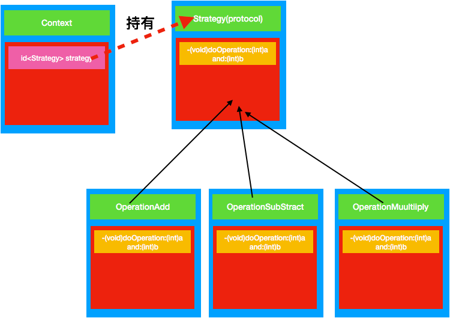

# 策略模式


策略模式定义了算法族,分别封装起来,让他们之间可以相互替换,此模式让算法的变化独立于使用算法的客户

# 定义
定义一系列的算法,把它们一个个封装起来, 并且使它们可相互替换
****
# 解决问题
在有多种算法相似的情况下，使用 if...else 所带来的复杂和难以维护。
******
# 角色
**环境(Context)角色**：持有一个Strategy的引用。

**抽象策略(Strategy)角色**：这是一个抽象角色，通常由一个接口或抽象类实现。此角色给出所有的具体策略类所需的接口。

**具体策略(ConcreteStrategy)角色**：包装了相关的算法或行为。
****
# 场景举例
1、诸葛亮的锦囊妙计，每一个锦囊就是一个策略。 
2、旅行的出游方式，选择骑自行车、坐汽车，每一种旅行方式都是一个策略。
*****
# 优缺点
### 优点
 1、算法可以自由切换。
 2、避免使用多重条件判断。
 3、扩展性良好。
### 缺点
1、策略类会增多。 2、所有策略类都需要对外暴露。
*****
# 使用条件
 1、如果在一个系统里面有许多类，它们之间的区别仅在于它们的行为，那么使用策略模式可以动态地让一个对象在许多行为中选择一种行为。
 2、一个系统需要动态地在几种算法中选择一种。
 3、如果一个对象有很多的行为，如果不用恰当的模式，这些行为就只好使用多重的条件选择语句来实现。

***
# 场景模拟
简单 的数学运算
***
#策略模式 UML 图



# 简单代码

```
#import <Foundation/Foundation.h>

@protocol Strategy <NSObject>
-(int)doOperation:(int)num1 and:(int)num2;
@end

```
```
#import <Foundation/Foundation.h>
#import "Strategy.h"
@interface OperationAdd : NSObject<Strategy>

@end
```

```

#import "OperationAdd.h"

@implementation OperationAdd
-(int)doOperation:(int)num1 and:(int)num2{
 NSLog(@"当前算法加法");
    return num2 + num1;
}
@end

```
```
#import <Foundation/Foundation.h>
#import "Strategy.h"
@interface OperationSubStract : NSObject<Strategy>

@end
```
```
#import "OperationSubStract.h"

@implementation OperationSubStract
-(int)doOperation:(int)num1 and:(int)num2
{
 NSLog(@"当前算法减法");
    return num1 - num2;
}
@end

```

```

#import <Foundation/Foundation.h>
#import "Strategy.h"
@interface OperationMultiply : NSObject<Strategy>

@end

```
```
#import "OperationMultiply.h"

@implementation OperationMultiply
-(int)doOperation:(int)num1 and:(int)num2{
 NSLog(@"当前算法乘法");
    return num1 * num2;
}
@end
```
```
#import <Foundation/Foundation.h>
#import "Strategy.h"
@interface Context : NSObject
@property (nonatomic,strong) id<Strategy> strategy;
-(void)calulate;
@end
```
```
#import "Context.h"

@implementation Context
-(void)calulate{
    NSLog(@" 第一个数10 第二个数5 计算结果 %d", [self.strategy doOperation:10 and:5]);
   
}
@end
```

测试代码
```
 Context * context = [[Context alloc]init];
    context.strategy = [OperationAdd new];
    [context calulate];
    context.strategy = [OperationMultiply new];
    [context calulate];
    context.strategy = [OperationSubStract new];
    [context calulate];

```
测试结果
```
2018-04-11 15:19:58.572533+0800 行为型设计模式-策略模式[70343:8738232] 当前算法加法
2018-04-11 15:19:58.572770+0800 行为型设计模式-策略模式[70343:8738232]  第一个数10 第二个数5 计算结果 15
2018-04-11 15:19:58.572981+0800 行为型设计模式-策略模式[70343:8738232] 当前算法乘法
2018-04-11 15:19:58.573085+0800 行为型设计模式-策略模式[70343:8738232]  第一个数10 第二个数5 计算结果 50
2018-04-11 15:19:58.573271+0800 行为型设计模式-策略模式[70343:8738232] 当前算法减法
2018-04-11 15:19:58.573370+0800 行为型设计模式-策略模式[70343:8738232]  第一个数10 第二个数5 计算结果 5
```


