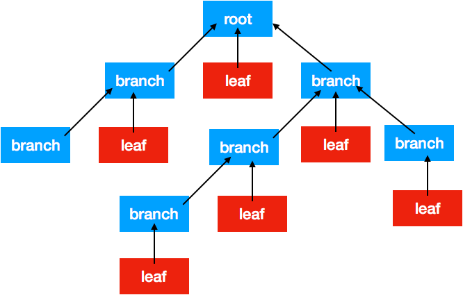

#  组合模式

# 定义
组合模式允许你将对象组合成树形结构来表现”部分-整体“的层次结构，使得客户以一致的方式处理单个对象以及对象的组合。

组合模式实现的最关键的地方是——简单对象和复合对象必须实现相同的接口。这就是组合模式能够将组合对象和简单对象进行一致处理的原因。（有点递归的意思）

***
# 角色
+ **组合部件（Component）**：它是一个抽象角色，为要组合的对象提供统一的接口。
+ **叶子（Leaf）**：在组合中表示子节点对象，叶子节点不能有子节点。
+ **合成部件（Composite）**：定义有枝节点的行为，用来存储部件，实现在Component接口中的有关操作，如增加（Add）和删除（Remove）。
****

# 分类
透明的组合模式、安全的组合模式
***
#场景模拟
设计XML 结构，要求打印每个节点的名字；
***

# 组合模式的UML图


***
# 安全模式代码

```
#import <Foundation/Foundation.h>

@interface ComponentSafe : NSObject
@property (nonatomic,strong) NSString * name;
- (instancetype)initWithName:(NSString *)name;
-(void)display:(int)level;
@end

```

```
#import "ComponentSafe.h"

@implementation ComponentSafe
- (instancetype)initWithName:(NSString *)name
{
    self = [super init];
    if (self) {
        self.name = name;
    }
    return self;
}

@end
```
```
#import "ComponentSafe.h"

@interface CompositeSafe : ComponentSafe
-(void)add:(ComponentSafe *)component;
-(void)remove:(ComponentSafe *)component;
@end

```
```
#import "CompositeSafe.h"
@interface CompositeSafe()
@property (nonatomic,strong) NSMutableArray *children;

@end
@implementation CompositeSafe
-(instancetype)initWithName:(NSString *)name{
    self= [super initWithName:name];
    if (self) {
        self.children = [NSMutableArray array];
    }
    return self;
}
-(void)add:(ComponentSafe *)component{
    [self.children addObject:component];
}
-(void)remove:(ComponentSafe *)component{
    [self.children removeObject:component];
}
-(void)display:(int)level{
    NSLog(@"- %d %@",level,self.name);
    for (ComponentSafe * component in self.children) {
        [component display:level +2];
    }
}


@end

```

```
#import <Foundation/Foundation.h>
#import "ComponentSafe.h"
@interface LeafSafe : ComponentSafe

@end

```
```

#import "LeafSafe.h"

@implementation LeafSafe
-(void)display:(int)level{
    NSLog(@"- %d %@",level,self.name);
}
@end
```

测试代码
```
  CompositeSafe * root = [[CompositeSafe alloc]initWithName:@"root"];

    [root add:[[LeafSafe alloc]initWithName:@"Leaf A in Root"]];
    [root add:[[LeafSafe alloc]initWithName:@"Leaf B in Root"]];

    
    CompositeSafe * branchX = [[CompositeSafe alloc]initWithName:@"branch x in root"];;
    CompositeSafe * branchY = [[CompositeSafe alloc]initWithName:@"branch y in root"];;

    [root add:branchX];
    [root add:branchY];
    
    [branchX add:[[LeafSafe alloc]initWithName:@"Leaf  in branchA"]];

    CompositeSafe * branchZ = [[CompositeSafe alloc]initWithName:@"branch z in branch X"];;
    [branchX add:branchZ];
    
    [branchY add:[[LeafSafe alloc]initWithName:@"Leaf  in branch Y"]];
    [branchZ add:[[LeafSafe alloc]initWithName:@"Leaf  in branch z"]];

    [root display:1];
```
测试结果
```
2018-04-08 18:02:22.958308+0800 结构型设计模式-组合模式[30405:7279512] - 1 root
2018-04-08 18:02:22.958412+0800 结构型设计模式-组合模式[30405:7279512] - 3 Leaf A in Root
2018-04-08 18:02:22.958517+0800 结构型设计模式-组合模式[30405:7279512] - 3 Leaf B in Root
2018-04-08 18:02:22.958680+0800 结构型设计模式-组合模式[30405:7279512] - 3 branch x in root
2018-04-08 18:02:22.958934+0800 结构型设计模式-组合模式[30405:7279512] - 5 Leaf  in branchA
2018-04-08 18:02:22.959220+0800 结构型设计模式-组合模式[30405:7279512] - 5 branch z in branch X
2018-04-08 18:02:22.959381+0800 结构型设计模式-组合模式[30405:7279512] - 7 Leaf  in branch z
2018-04-08 18:02:22.959570+0800 结构型设计模式-组合模式[30405:7279512] - 3 branch y in root
2018-04-08 18:02:22.959792+0800 结构型设计模式-组合模式[30405:7279512] - 5 Leaf  in branch Y
```
***
# 透明模式代码
```

#import <Foundation/Foundation.h>

@interface Component : NSObject
@property (nonatomic,strong) NSString *name;
-(void)add:(Component *)component;
-(void)remove:(Component *)component;
-(void)display:(int)level;
@end

```

```
#import "Component.h"

@implementation Component


@end

```
```
#import "Component.h"

@interface Leaf : Component

@end
```
```
#import "Leaf.h"

@implementation Leaf
-(void)add:(Component *)component{
    NSLog(@"can not add a component to a leaf.");
}

-(void)remove:(Component *)component{
    NSLog(@"can not remove a component to a leaf");
}
-(void)display:(int)level{
    NSLog(@"- %d %@",level,self.name);
}
@end
```
```
#import "Component.h"

@interface Composite : Component

@end
```
```

#import "Composite.h"
@interface Composite()
@property (nonatomic,strong) NSMutableArray *children;
@end
@implementation Composite
- (instancetype)init
{
    self = [super init];
    if (self) {
        self.children = [NSMutableArray array];
    }
    return self;
}
-(void)add:(Component *)component{
    [self.children addObject:component];
}

-(void)remove:(Component *)component{
    [self.children removeObject:component];
}
-(void)display:(int)level{
    NSLog(@"- %d %@",level,self.name);
    for (Component * component in self.children) {
        [component display:level +2];
    }
}
@end
```
测试代码

```
 Component * root = [Composite new];
    root.name =@"root";
    Component * a = [Leaf new];
    a.name = @"Leaf in Root";
    [root add:a];
    Component * b = [Leaf new];
    b.name = @"Leaf in Root";
    [root add:b];
    
    Component * branchX = [Composite new];
    branchX.name=@"branch x in root";
    [root add:branchX];
    
    Component * branchY = [Composite new];
    branchY.name=@"branch y in root";
    [root add:branchY];
    
    Component * leafA = [Leaf new];
    leafA.name = @"leaf  in Branch X";
    [branchX add:leafA];
    
    Component * branchZ = [Composite new];
    branchZ.name = @"branch z in Branch X";
    [branchX add:branchZ];
    
    Component * leafY = [Leaf new];
    leafY.name = @"leaf in Branch y";
    [branchY add:leafY];
    
    Component * leafz = [Leaf new];
    leafz.name = @"leaf in Branch z";
    [branchZ add:leafz];
    [root display:1];
```
测试结果
```
2018-04-08 18:02:22.957212+0800 结构型设计模式-组合模式[30405:7279512] - 1 root
2018-04-08 18:02:22.957364+0800 结构型设计模式-组合模式[30405:7279512] - 3 Leaf in Root
2018-04-08 18:02:22.957458+0800 结构型设计模式-组合模式[30405:7279512] - 3 Leaf in Root
2018-04-08 18:02:22.957554+0800 结构型设计模式-组合模式[30405:7279512] - 3 branch x in root
2018-04-08 18:02:22.957659+0800 结构型设计模式-组合模式[30405:7279512] - 5 leaf  in Branch X
2018-04-08 18:02:22.957873+0800 结构型设计模式-组合模式[30405:7279512] - 5 branch z in Branch X
2018-04-08 18:02:22.957955+0800 结构型设计模式-组合模式[30405:7279512] - 7 leaf in Branch z
2018-04-08 18:02:22.958030+0800 结构型设计模式-组合模式[30405:7279512] - 3 branch y in root
2018-04-08 18:02:22.958141+0800 结构型设计模式-组合模式[30405:7279512] - 5 leaf in Branch y
```
***

> 透明组合模式和安全组合模式区别就是叶子是否有add：和remove方法。有就是透明组合，没有就是安全组合，（因为叶子调用add：和remove：在编译阶段就报错了）

***
# 优缺点

### 优点
 + 组合模式使得客户端代码可以一致地处理对象和对象容器，无需关心处理的是单个对象，还是组合的对象容器。
+ 将”客户代码与复杂的对象容器结构“解耦。
+ 可以更容易地往组合对象中加入新的构件。

### 缺点
+ 使得设计更加复杂。客户端需要花更多时间理清类之间的层次关系。

**注意问题**
+ 有时候系统需要遍历一个树枝结构的子构件很多次，这时候可以考虑把遍历子构件的结构存储在父构件里面作为缓存。
+ 客户端尽量不要直接调用树叶类中的方法（在我上面实现就是这样的，创建的是一个树枝的具体对象;），而是借用其父类（Graphics）的多态性完成调用，这样可以增加代码的复用性。

> 《设计模式》一书中提倡：**相对于安全性，我们比较强调透明性。**对于第一种方式中叶子节点内不需要的方法可以使用空处理或者异常报告的方式来解决。(因为这样可以使用基类处理，符合依赖倒置原则，有更好的扩展性)


[借鉴博客](https://www.cnblogs.com/snaildev/p/7647190.html)


