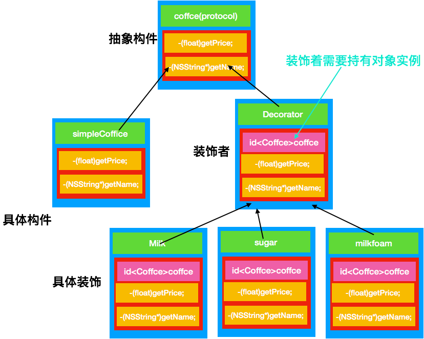

# 装饰模式


 `装饰者和被装饰对象有相对超类型`
 可以用一个或者多个装饰者包装一个对象
 既然装饰者和被装饰者有相同的超类型,所以在任何需要原始对象的场合,都可以用装饰过的对象进行代替.

 ### 装饰者模式

    装饰者模式动态地将责任附加到对象上.若要扩展功能,装饰者提供了比继承更具有弹性的替代方案.

 # 定义
 装饰模式指的是在不必改变原类文件和使用继承的情况下，动态地扩展一个对象的功能。它是通过创建一个包装对象，也就是装饰来包裹真实的对象。*（其实每次看定义我都是很懵逼的，明白最好还是通过UML 图和源码仔细体会才行）*
****

 # 特点
 （1） **装饰对象和真实对象有相同的接口**。这样客户端对象就能以和真实对象相同的方式和装饰对象交互。
 （2） **装饰对象包含一个真实对象的引用（reference）**
 （3） **装饰对象接受所有来自客户端的请求。**它把这些请求转发给真实的对象。
 （4） **装饰对象可以在转发这些请求以前或以后增加一些附加功能。**这样就确保了在运行时，不用修改给定对象的结构就可以在外部增加附加的功能。在面向对象的设计中，通常是通过继承来实现对给定类的功能扩展。

***
 # 适用性
 > 1. 需要扩展一个类的功能，或给一个类添加附加职责。
 > 2. 需要动态的给一个对象添加功能，这些功能可以再动态的撤销。
 > 3. 需要增加由一些基本功能的排列组合而产生的非常大量的功能，从而使继承关系变的不现实。
 > 4. 当不能采用生成子类的方法进行扩充时。一种情况是，可能有大量独立的扩展，为支持每一种组合将产生大量的子类，使得子类数目呈爆炸性增长。另一种情况可能是因为类定义被隐藏，或类定义不能用于生成子类。

***
 # 优缺点
 ### 优点
 > 1. 装饰者模式与继承关系的目的都是要扩展对象的功能，但是装饰者可以提供比继承更多的灵活性。
 > 2. 通过使用不同的具体装饰类以及这些装饰类的排列组合，设计师可以创造出很多不同行为的组合。

 ### 缺点

 > 1. 这种比继承更加灵活机动的特性，也同时意味着更加多的复杂性。
 > 2. 装饰模式会导致设计中出现许多小类，如果过度使用，会使程序变得很复杂。
 > 3. 装饰模式是针对抽象组件（Component）类型编程。但是，如果你要针对具体组件编程时，就应该重新思考你的应用架构，以及装饰者是否合适。当然也可以改变Component接口，增加新的公开的行为，实现“半透明”的装饰者模式。在实际项目中要做出最佳选择。

***
 # 设计原则
 > 1. 多用组合，少用继承。
 **利用继承设计子类的行为，是在编译时静态决定的，而且所有的子类都会继承到相同的行为。然而，如果能够利用组合的做法扩展对象的行为，就可以在运行时动态地进行扩展。**
 >2. 类应设计的对扩展开放，对修改关闭。(开闭原则)
***
 # 角色

 >（1）抽象构件（Component）角色：给出一个抽象接口，以规范准备接收附加责任的对象。
 >（2）具体构件（Concrete Component）角色：定义一个将要接收附加责任的类。
 >（3）装饰（Decorator）角色：持有一个构件（Component）对象的实例，并实现一个与抽象构件接口一致的接口。
 >（4）具体装饰（Concrete Decorator）角色：负责给构件对象添加上附加的责任。

***
 # 场景模拟
 假设让你给咖啡店设计算费后台，咖啡中可以添加不同的配料，牛奶，糖，奶泡等，不同的饮品加上不同的配料会有不同的价格。
 # UML 图
 
***

 # 简单代码

 ```
 #import <Foundation/Foundation.h>

 @protocol Coffce <NSObject>
 -(float)getPrice;
 -(NSString*)getName;
 @end
 ```

 ```
 #import <Foundation/Foundation.h>
 #import "Coffce.h"
 @interface Decorator : NSObject<Coffce>
 @property (nonatomic,strong) id<Coffce> coffce;
 - (instancetype)initWithCoffce:(id<Coffce>)coffce;
 @end
 ```
 ```

 #import "Decorator.h"
 @interface Decorator()
 @end
 @implementation Decorator
 - (instancetype)initWithCoffce:(id<Coffce>)coffce
 {
     self = [super init];
     if (self) {
         self.coffce = coffce;
     }
     return self;
 }
 @end
 ```
 ```
 #import <Foundation/Foundation.h>
 #import "Coffce.h"
 @interface SimpleCoffce : NSObject<Coffce>

 @end
 ```
 ```
 #import "SimpleCoffce.h"
 @interface SimpleCoffce()
 @property (nonatomic,assign) float price;
 @property (nonatomic,strong) NSString * name;
 @end
 @implementation SimpleCoffce
 - (instancetype)init
 {
     self = [super init];
     if (self) {
         self.price = 10;
         self.name = @"simpleCoffce";
     }
     return self;
 }
 -(float)getPrice{
     return self.price;
 }
 -(NSString *)getName{
     return @"simpleCoffice";
     
 };
 @end
 ```
 ```
 #import "Decorator.h"

 @interface MilkPriceDecorator : Decorator

 @end

 ```
 ```
 #import "MilkPriceDecorator.h"

 @implementation MilkPriceDecorator
 -(float)getPrice{
     return [self.coffce getPrice]+7;
 }
 -(NSString *)getName{
     return [[self.coffce   getName] stringByAppendingString:@"  addMilk"];
 }
 @end
 ```
 ```
 #import "Decorator.h"

 @interface MilkFoamDecrator : Decorator

 @end

 ```
 ```
 #import "MilkFoamDecrator.h"

 @implementation MilkFoamDecrator
 -(float)getPrice{
     return [self.coffce getPrice]+12;
 }
 -(NSString *)getName{
     return [[self.coffce   getName] stringByAppendingString:@"  addMilkFoam"];
 }
 @end
 ```
 ```
 #import "Decorator.h"

 @interface SugarDecrator : Decorator

 @end

 ```
 ```
 #import "SugarDecrator.h"

 @implementation SugarDecrator
 -(float)getPrice{
     return [self.coffce getPrice]+5;
 }
 -(NSString *)getName{
     return [[self.coffce  getName] stringByAppendingString:@"   addSugar"];
 }

 @end
 ```
 测试代码
 ```
     id <Coffce> coffce = [SimpleCoffce new];
     coffce= [[SugarDecrator alloc]initWithCoffce:coffce];
     coffce = [[MilkFoamDecrator alloc]initWithCoffce:coffce];
     coffce = [[MilkPriceDecorator alloc]initWithCoffce:coffce];
     float price = [coffce getPrice];
     NSString * name = [coffce getName];
     NSLog(@"%@ %lf" ,name,price);
 ```
 测试结果
 ```
 [34339:7420628] simpleCoffice   addSugar  addMilkFoam  addMilk 34.000000
 ```

****


 [百度百科](https://baike.baidu.com/item/装饰模式/10158540?fr=aladdin)
 [借鉴博客](https://blog.csdn.net/gdutxiaoxu/article/details/51885105)
