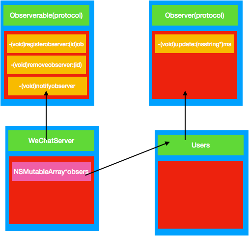

# 观察者模式


> 出版者+订阅者=观察者模式


观察者模式 定义了对象之间的一对多依赖,这样一来,当一个对象改变状态时,他的所有依赖着都会收到通知并自动更新.


### 松耦合的威力

当两个对象之间松耦合,他们依然可以交互,但是不太清楚彼此的细节

观察者模式提供了一种对象设计,让主题和观察者之间松耦合

> 不要依赖与观察者被通知的顺序


使用此模式,可以被观察者推或者拉取数据


> 在观察者模式中,会改变的是主题的状态,以及观察者的数目和类型.用这个模式,亦可以改变依赖于主题状态的对象,却不必改变主题.这叫提前规划

> 主题与观察者都使用接口;观察者利用主题的接口想主题注册,而主题利用观察者接口通知观察者.这样可以让两者之间运作正常,又同时具有松耦合的有点

> 观察者模式利用"组合"将许多观察者组合进主题中.对象之间的这种关系不是通过继承来实现的,而是在运行时利用组合的方式而产生的.


# 定义
定义对象间的一种一对多的依赖关系，当一个对象的状态发生改变时，所有依赖于它的对象都得到通知并被自动更新。
***
# 解决问题
一个对象状态改变给其他对象通知的问题，而且要考虑到易用和低耦合，保证高度的协作。
****
# 角色
1、**抽象被观察者角色**：也就是一个抽象主题，它把所有对观察者对象的引用保存在一个集合中，每个主题都可以有任意数量的观察者。抽象主题提供一个接口，可以增加和删除观察者角色。一般用一个抽象类和接口来实现。
2、**抽象观察者角色**：为所有的具体观察者定义一个接口，在得到主题通知时更新自己。
3、**具体被观察者角色**：也就是一个具体的主题，在集体主题的内部状态改变时，所有登记过的观察者发出通知。
4、**具体观察者角色**：实现抽象观察者角色所需要的更新接口，一边使本身的状态与制图的状态相协调。

***
# 使用场景
一个对象（目标对象）的状态发生改变，所有的依赖对象（观察者对象）都将得到通知，进行广播通知。
***
# 关键代码
在抽象类里有一个 ArrayList 存放观察者们。
***
# 优缺点
### 优点
1、观察者和被观察者是抽象耦合的。 
2、建立一套触发机制。
### 缺点： 
1、如果一个被观察者对象有很多的直接和间接的观察者的话，将所有的观察者都通知到会花费很多时间。 
2、如果在观察者和观察目标之间有循环依赖的话，观察目标会触发它们之间进行循环调用，可能导致系统崩溃。 
3、观察者模式没有相应的机制让观察者知道所观察的目标对象是怎么发生变化的，而仅仅只是知道观察目标发生了变化。

***
# 场景模拟
有一个微信公众号服务，不定时发布一些消息，关注公众号就可以收到推送消息，取消关注就收不到推送消息。
# 观察者模式UML 图


# 简单代码
```
#import <Foundation/Foundation.h>

@protocol Observer <NSObject>
-(void)update:(NSString*)message;
@end

```
```
#import <Foundation/Foundation.h>
#import "Observer.h"
@protocol Observerable <NSObject>
-(void)registerObserver:(id<Observer>)observer;
-(void)removeObserver:(id<Observer>)observer;
-(void)notifyObserver;
@end
```
```
#import <Foundation/Foundation.h>
#import "Observerable.h"
@interface WeChatServer : NSObject<Observerable>
-(void)setMessage:(NSString *)message;
@end

```
```
#import "WeChatServer.h"
@interface WeChatServer()
@property (nonatomic,strong) NSMutableArray *obsersers;
@end
@implementation WeChatServer
- (instancetype)init
{
    self = [super init];
    if (self) {
        self.obsersers=[NSMutableArray new];
    }
    return self;
}
static NSString * _message =nil;
-(void)setMessage:(NSString *)message{
    _message = message;
    [self notifyObserver];
}
-(void)registerObserver:(id<Observer>)observer{
    [self.obsersers addObject:observer];
}

-(void)removeObserver:(id<Observer>)observer{
    [self.obsersers removeObject:observer];
}

-(void)notifyObserver{
    for (id<Observer> observer in self.obsersers) {
        [observer update:_message];
    }
}

@end

```
```
#import <Foundation/Foundation.h>
#import "Observer.h"
@interface User : NSObject<Observer>

@end

```
```
#import "User.h"

@implementation User
-(void)update:(NSString *)message{
    NSLog(@"%@ 收到消息 %@",self,message);
}
@end

```
测试代码
```
    WeChatServer * server=  [WeChatServer new];
    User * userOne = [User new];
    User * userTwo = [User new];
    [server registerObserver:userOne];
    [server setMessage:@"博雅论坛"];
    [server registerObserver:userTwo];
    [server setMessage:@"博雅论坛最新消息"];
    [server removeObserver:userOne];
    [server setMessage:@"博雅论坛结束了"];
```
测试结果
```
2018-04-11 11:42:15.076078+0800 行为型设计模式-观察者模式[65404:8615411] <User: 0x604000014290> 收到消息 博雅论坛
2018-04-11 11:42:15.076285+0800 行为型设计模式-观察者模式[65404:8615411] <User: 0x604000014290> 收到消息 博雅论坛最新消息
2018-04-11 11:42:15.076383+0800 行为型设计模式-观察者模式[65404:8615411] <User: 0x604000014280> 收到消息 博雅论坛最新消息
2018-04-11 11:42:15.076532+0800 行为型设计模式-观察者模式[65404:8615411] <User: 0x604000014280> 收到消息 博雅论坛结束了
```

