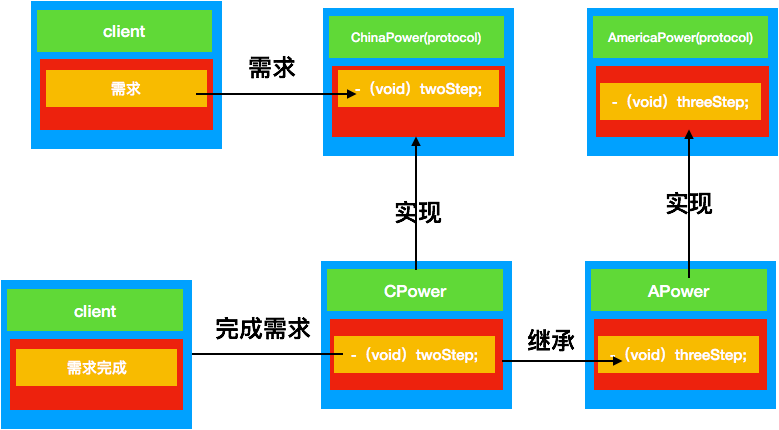
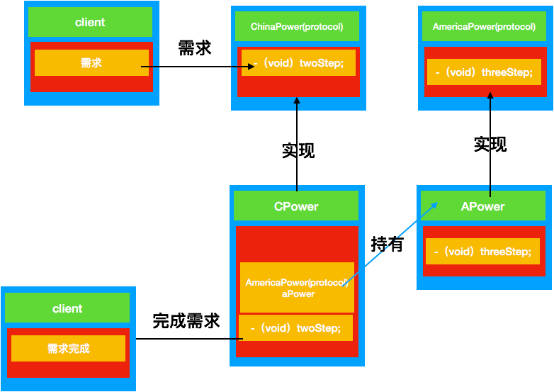

#  适配器模式


# 定义
在计算机编程中，适配器模式（有时候也称包装样式或者包装）将一个类的接口适配成用户所期待的。一个适配允许通常因为接口不兼容而不能在一起工作的类工作在一起，做法是将类自己的接口包裹在一个已存在的类中。
****

# 模式分类
+ 对象适配器模式

> 在这种适配器模式中，适配器容纳一个它包裹的类的实例。在这种情况下，适配器调用被包裹对象的物理实体。

+ 类适配器模式

> 这种适配器模式下，适配器继承自已实现的类（一般多重继承）。

　适配器就是一种适配中间件，它存在于不匹配的二者之间，用于连接二者，将不匹配变得匹配，简单点理解就是平常所见的转接头，转换器之类的存在。

***
# 使用场景
+ 系统需要使用现有的类,而此类接口不符合系统的需要,即接口不兼容
+ 想要建立一个可重复使用的类,用于关联彼此没有太大关联的一些类(包括即将引入的类)
+ 需要一个统一的输出接口,而输入端类型不确定.

>  总结来说就两点
>  1.输入端不变，那么输出端改变
>  2.输入端变化，那么输出端不变

***
# 场景描述
我从美国带回来一个美国插头，美国插头是三角插头的。但是中国家里的插座都是两角插座。因此我需要将美国插头，改装成可以两角插座可以用的两角插头
***
# 适配器模式 类UML图



# 代码
```
#import <Foundation/Foundation.h>

@protocol AmericaPower <NSObject>
-(void)threeStep;
@end
```

```
#import <Foundation/Foundation.h>
#import "AmericaPower.h"
@interface APower : NSObject<AmericaPower>
@end
```
```
#import "APower.h"

@implementation APower
-(void)threeStep{
    NSLog(@"我是三角电源");
}
@end
```
```
#import <Foundation/Foundation.h>

@protocol ChinaPower <NSObject>
-(void)twoStep;
@end
```
```
#import <Foundation/Foundation.h>
#import "ChinaPower.h"
#import "APower.h"
@interface CPower :APower <ChinaPower>

@end
```
```
#import "CPower.h"

@implementation CPower
-(void)twoStep{
    [self threeStep];
}
@end
```
测试代码
```
   ///类对象适配
    [[CPower new] twoStep];
```
测试结果
```
2018-04-08 14:49:40.712315+0800 结构型设计模式-适配器模式[25250:7129936] 我是三角电源
```
***
# 适配器模式 对象UML图


***
#对象适配器代码
```
#import <Foundation/Foundation.h>
#import "APower.h"
#import "ChinaPower.h"
@interface CObjectPower : NSObject<ChinaPower>

@end
```
```
#import "CObjectPower.h"

@implementation CObjectPower
-(void)twoStep{
    [[APower new] threeStep];
}
@end
```
测试代码
```
    [[CObjectPower new]twoStep];
```
测试结果
```
2018-04-08 14:49:40.712508+0800 结构型设计模式-适配器模式[25250:7129936] 我是三角电源
```
***

# 总结
```
这两者之间的区别是类适配器是继承了实例对象，获取了实例对象的功能。
对象适配器是在内部实例化了一个实例对象，没有实例对象的功能。
```


参考
[百度百科](https://baike.baidu.com/item/适配器模式/10218946?fr=aladdin)

[借鉴博客](https://www.cnblogs.com/honger/p/5970283.html)


